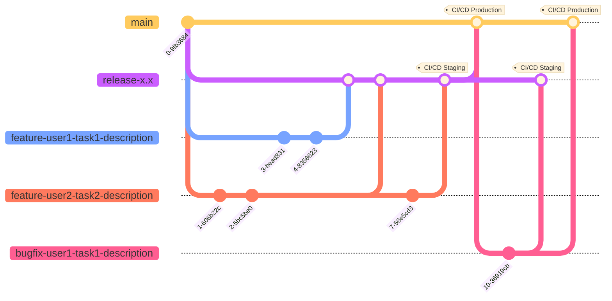

# Git Flow Best Practice

From the git graph above, we can well-managed the branches with different purpose.
- [Release branch](#release-branch)
- [Feature branches](#feature-branches)
- [Bugfix branch](#bugfix-branch)

### Release branch
> Example: `release-x.x`

This branch is made for the upcoming production release. It is best branch to run the CI/CD for `staging` environment so that developers & testers can verify the reliability of the new release before deploy to `production` environment. 

---
### Feature branches
> Example: `feature-userx-taskx-description`

Each branch gets a unique identifier combining the developer's name, task ID, and a critical description of the task. Get ready for streamlined collaboration and instant context. Embrace the power of clear branch names today!

---
### Bugfix branch
> Example: `bugfix-userx-taskx-description`

By right all the bugs should be detected and fixed in `staging` environment so this branch should NOT exist but somehow Morphy's Law still works. Branch out from `main` and fix it ASAP, then merge into `release-x.x` for testing in `staging` environment again before roll out to `production` environment.
