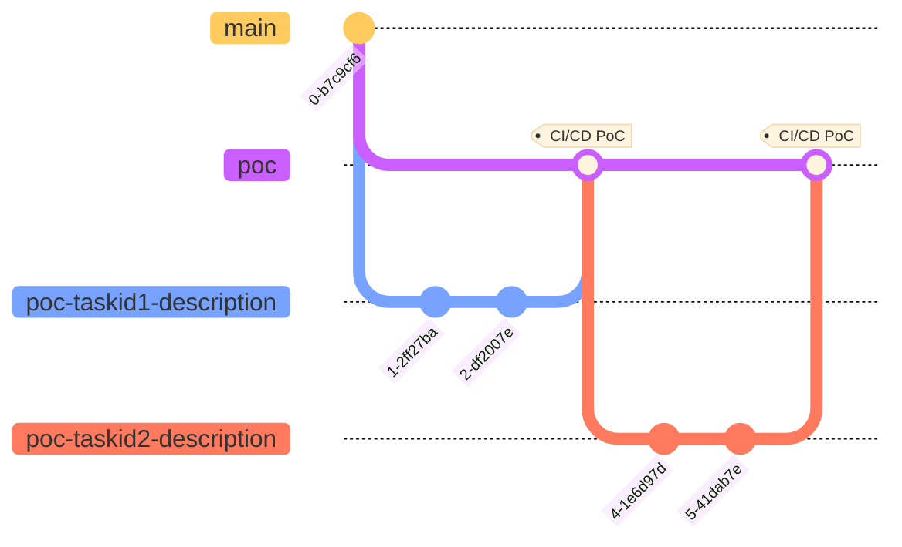

# Git Flow Best Practice for PoC Product

> This git flow is designed for the product which is under Proof of Concept(PoC) phase with agile methodology

From the git graph above, we can well-managed the branches with different purpose.

- [PoC branch](#poc-branch)
- [Task branches](#task-branches)

### PoC branch

> Example: `poc`

This branch will be the ONLY source of truth for the PoC environment. Every test users/early adopters are using or testing the outcome from this branch.

---

### Task branches

> Example: `poc-taskid-description`

Each branch gets a unique identifier combining the task ID, and a critical description of the task. At most of the time, in the PoC product, there will only be one developer so we can ignore the developer's name.

This can be used as a bugfix branch as well.
